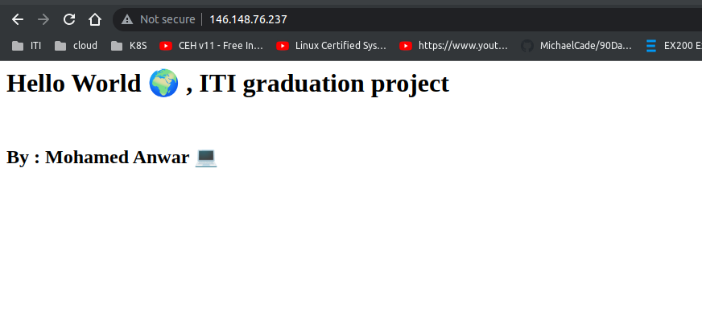

# Simple node js app 
For testing ci/cd pipeline 

### Infrastructure [Repo ](https://github.com/mohamedanwer006/jenkins-gke-ci-cd)

---

## Testing app local

#### Build image
```
docker build -t simple-node-app:latest .
```

#### Run image
```
docker run  -d -p 3000:3000 simple-node-app
```

>Access the app at http://localhost:3000

### Response:


### CI pipeline 


### CI-CD pipeline


### Create a custom image of jenkins that contain kubectl
Create a github action pipeline to build a custom image of jenkins that contain kubectl,
this make it faster 🚀 to push to DockerHub than using my laptop 💻

### Test application after deploy

```bash
kubectl get services -n jenkins-ns

└─ mohamed@DevOps:$ kubectl get services  -n app-ns
NAME                TYPE           CLUSTER-IP     EXTERNAL-IP      PORT(S)        AGE
app-load-balancer   LoadBalancer   10.52.15.131   146.148.76.237   80:31744/TCP   6m44s

```

#### Hit the external ip of the ***app-load-balancer*** service

> response:


