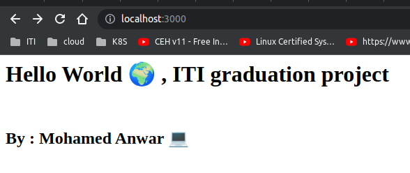
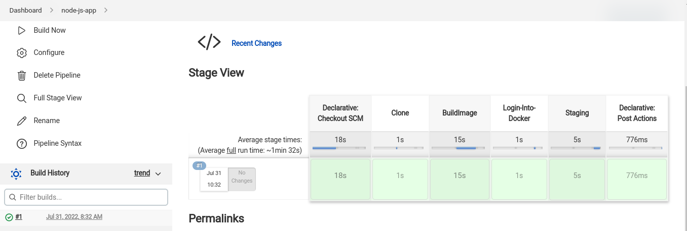
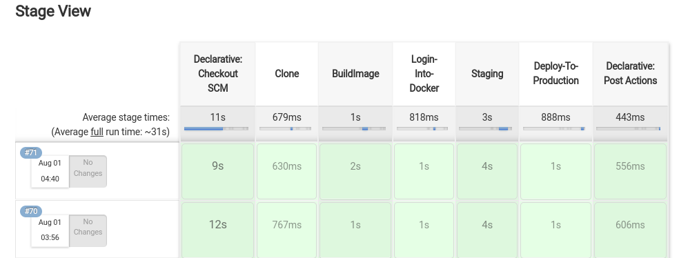
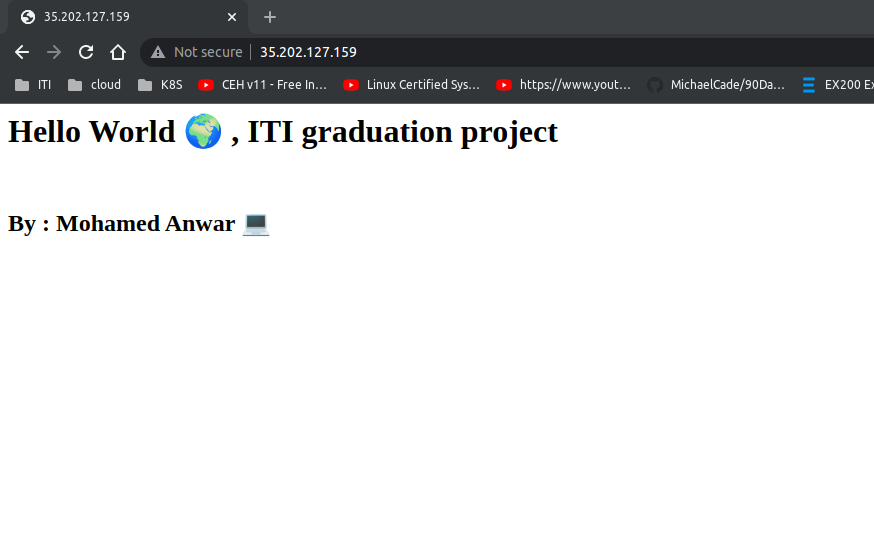

# Simple node js app 
For testing ci/cd pipeline 

### Infrastructure [Repo ](https://github.com/mohamedanwer006/jenkins-gke-ci-cd)

---

## Testing app local

#### Build image
```
docker build -t simple-node-app:latest .
```

#### Run image
```
docker run  -d -p 3000:3000 simple-node-app
```

>Access the app at http://localhost:3000

### Response:



### Create a CI pipeline 




### CI-CD pipeline




### Create a custom image of jenkins that contain kubectl
Create a github action pipeline to build a custom image of jenkins that contain kubectl,
this make it faster 🚀 to push to DockerHub than using my laptop 💻

### Test application after deploy

```bash
kubectl get services -n jenkins-ns

mohamed@DevOps:$ kubectl get services -n jenkins-ns 
NAME                TYPE           CLUSTER-IP    EXTERNAL-IP      PORT(S)          AGE
app-load-balancer   LoadBalancer   10.52.8.96    35.202.127.159   80:32500/TCP     19m
jenkins-jnlp        ClusterIP      10.52.0.156   <none>           50000/TCP        18h
load-balancer       LoadBalancer   10.52.4.230   34.173.205.12    8080:30413/TCP   25m

```

#### Hit the external ip of the ***app-load-balancer*** service

> response:


